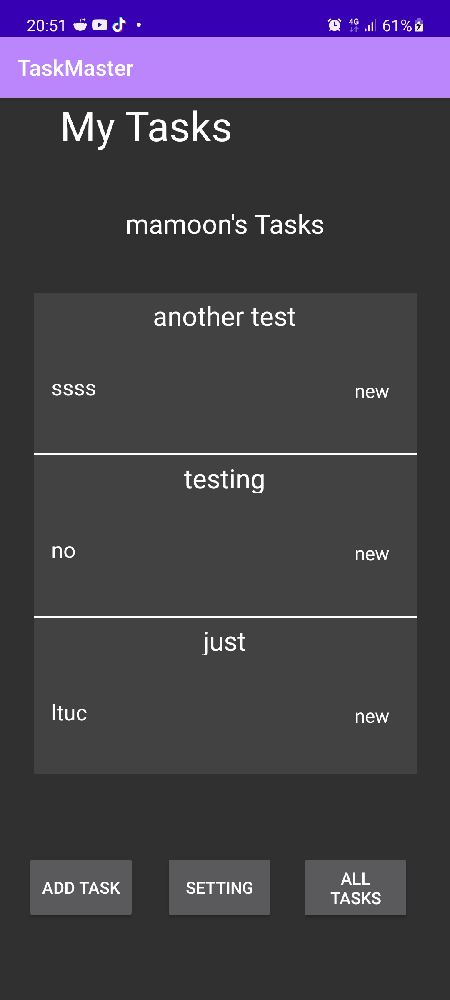

# Taskmaster

This is an android application that will display your added task, and you can add task to it.

## Change Log

- 14/11/2021 19:30:

  1. added the base functionality to move between activities and dummy button to add the task
     > Note: although the button "add task" increase the number but is dummy button and will not add anything to the memory or the database
  2. Chosen the Color Pallet -maybe i will change it later

     1.  `#000000`

     2.  `#3E065F`

     3.  `#700B97`

     4.  `#8E05C2`

  3. Set Dark Theme Color to make the text Readable in Dark theme
  4. Add Unit Test For the Task Class
     > Note: The class just have setter and getter and the test is just general test for them and for the constructor method will be added in the future.

- 15/11/2021 19:50

  1. Added the shared preference to set the username (default anonymous)
     > The User can Set the username in the settings
  2. Added three task to the main page when clicked on one of them new activity will open contain the title along with description.
  3. Added setting button in the main page to open the settings activity.

- 16/11/2021 20:55

  1. Added the functionality to add task page where the task will be added to the shared preference.
  2. Added RecyclerView to the main page and All Task page where in the main page will display the newest three added task.
  3. When the user run the app for the first time the shared preference will seed with 6 task.

- 21/11/2021 09:53

  1. Added room database to the app and added the task class to the database.
  2. Added the functionality to add task to the database.

- 24/11/2021 10:09

  1. Added Amplify to the app and added the functionality to add task to the database.
  2. Added the functionality to add task to the database.
  3. Removed Room Database and added the functionality to add task to the database.

- 24/11/2021 22:20

  1. Add Connection to graphql.
  2. Add Team Model into graphql.
  3. Insert 3 HardCoded team into the app.
  4. User can set their team and filter the result accord to it.

- 28/11/2021: 21:15
  1. Add Sign in with web UI.
  2. Now the User name will be according to his signed in user name.
- 29/11/2021: 19:55
  1. Added the upload Function to the App so the user can add File to S3
  2. Show if image in the task Detail activity

## Screen Shots

- 14/11/2021
    
  
  
  

- 15/11/2021
  
  
  

- 16/11/2021
  
  
  
  

- 24/11/2021
  
  
  

- 24/11/2021 (night)
  
  
  
  

- 28/11/2021
  
  
  
